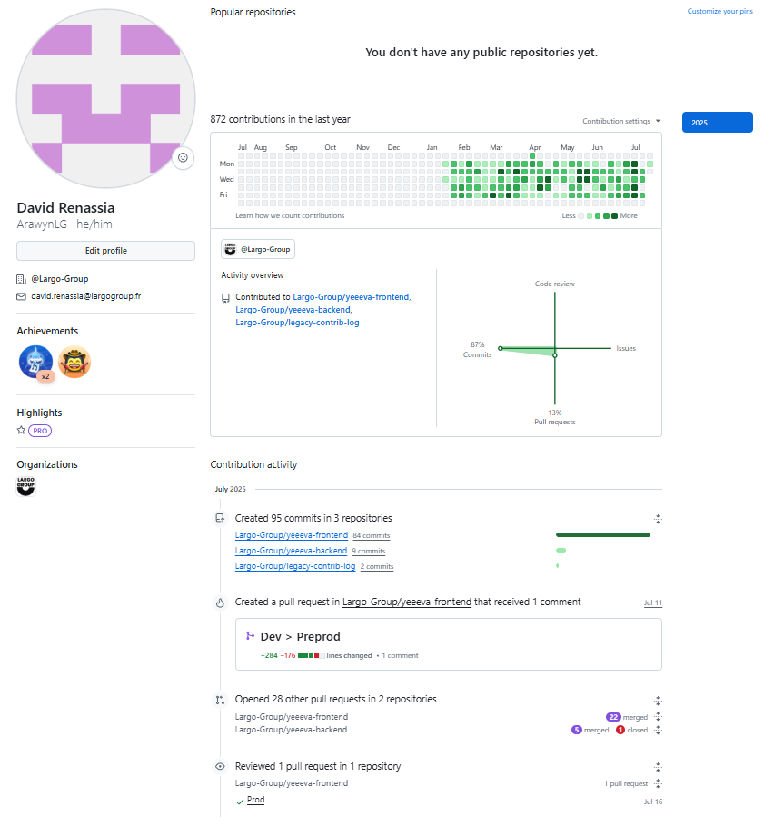

# 
👋 Bienvenue sur mon GitHub / Welcome to my GitHub

---

<strong>Version française</strong>

 

<!------------------------------------- Présentation ------------------------------------>
## 
👨‍💻 Présentation

Je suis **David Renassia**, développeur passionné par l'informatique, les jeux vidéo, l'intelligence artificielle, et plus généralement par les nouvelles technologies et tout ce qui touche au code.

Après une **expérience professionnelle de 6 mois** en tant que développeur full-stack dans une startup tech, je suis actuellement à la recherche d'une **alternance de deux ans** dans le cadre du **titre RNCP “Expert en architecture informatique”**, option **Architecture de données**, à l'**École 42 de Perpignan**.

Mes compétences couvrent le **développement logiciel**, la **programmation bas-niveau (C)**, la **programmation orientée objet (C++)**, le **développement web** (HTML, CSS, JavaScript, React, Node.js), ainsi que le **développement de jeux vidéo** (Godot, Unity). Je maîtrise aussi des outils comme **Docker**, **Git**, et l’architecture **serverless** avec AWS.

Je suis particulièrement motivé par les projets complexes, la recherche de solutions techniques élégantes et la création d’expériences utilisateur immersives.

🎯 **Je suis disponible immédiatement** pour une alternance et prêt à m'investir sur des projets à fort potentiel technique et humain.

 

<!----------------------------------- Projets réalisés ---------------------------------->
## 
🚀 Projets réalisés

<!----------------------------- Expériences professionnelles ---------------------------->
### 💼 Expériences professionnelles

<!-- Largo Group -->

🏢 <strong>Largo Group</strong> : Développeur full-stack
 

⏳ **6 mois d'expérience professionnelle**, entre janvier 2025 et juillet 2025, en tant que **développeur full-stack** chez **Largo Group**, une startup développant l'application **Yeeeva**, une solution optimale de gestion de projets.

📊 <strong>Historique de contributions GitHub (compte pro)</strong>

⚠️ Un compte GitHub professionnel requis pour contribuer à Yeeeva. Une fois retiré de l'organisation, mon historique sera publiquement inaccessible.  
Ci-dessous, une capture de mes **872 contributions** réalisées sur ce compte :

🔧 <strong>Missions principales</strong>

- Développement de **fonctionnalités avancées** en **React** et **Node.js**, en parfaite autonomie.
- Conception et implémentation complète de **fonctionnalités clés**, notamment deux modules indépendants : gestion budgétaire et suivi financier.
- Création et intégration d'**API** en NoSQL, gestion de modèles de données via **DynamoDB**.
- Intégration et exploitation d’**API tierces** (gestion de fichiers, images, e-mails…).
- **Optimisation UX** (MUI, AgGrid, Tailwind CSS...).
- Maintenance de l’**infrastructure cloud** sur **AWS** (Lambda, S3, Cloudwatch…).
- **Débogage avancé** et **assistance technique** à l’équipe de développement.
- **Documentation technique**, création de notices et spécifications internes.
- **Rôle de référent technique** d'une équipe de 8 développeurs.
- Réalisation de tests utilisateurs, d’assurance qualité et de non-régression.
- Gestion d'environnements de développement et de production.

🚀 <strong>Ce que j’ai appris</strong>

- **Développement** et **mise en production** d’un produit réel, dans un cadre contraint (délai, budget, qualité).
- Collaboration en environnement startup : gestion de **priorités mouvantes**, adaptation rapide et **autonomie forte**.
- Approfondissement de mon usage d’**AWS** et de la logique **serverless**.
- Implication progressive dans un **rôle central** (référent technique & DevOps), malgré un statut de stagiaire.

📈 <strong>Compétences renforcées</strong>

- **JavaScript / TypeScript / React / Node.js / HTML5 / CSS / Tailwind CSS / MUI / AgGrid / DynamoDB**
- **AWS (Lambda, S3, CloudWatch, Cognito) / Serverless / GitHub**
- **API REST / architecture backend / gestion des erreurs / tests**
- **SCRUM / gestion de projet / autonomie / communication technique / rigueur professionnelle**

 

<!--------------------------- Projets réalisés pour l'école 42 -------------------------->
### 📚 Projets réalisés pour l’École 42

<!-- libft -->

🗂️ <strong>libft</strong> : Réimplémentation des fonctions standards du langage C
 

🔗 [Voir le projet sur GitHub](https://github.com/Arawyn42/42_libft)

Une réimplémentation des fonctions standards du langage C. Ce projet m'a permis de maîtriser les aspects bas-niveau de la programmation en C, ainsi que la gestion de la mémoire et l'optimisation des fonctions courantes. Il m'a également permis de mieux maîtriser les concepts de pointeurs et de listes chaînées.

<!-- ft_printf -->

🖨️ <strong>ft_printf</strong> : Recodage de la fonction printf en C
 

🔗 [Voir le projet sur GitHub](https://github.com/Arawyn42/42_ft_printf)

Un exercice essentiel pour comprendre le formatage de chaînes, la gestion des arguments variadiques et la manipulation de mémoire dynamique.

<!-- get_next_line -->

📄 <strong>get_next_line</strong> : Lecture ligne par ligne d’un fichier
 

🔗 [Voir le projet sur GitHub](https://github.com/Arawyn42/42_get_next_line)

Création d'une fonction permettant de lire la prochaine ligne d'un descripteur de fichier. Ce projet m'a aidé à développer des compétences en gestion de fichiers et en manipulation de buffers.

<!-- born2beroot -->

🖥️ <strong>born2beroot</strong> : Installation et configuration Linux
 

Mise en place et configuration d'une machine virtuelle tournant sous Linux. Ce projet m'a permis de me familiariser avec les environnements systèmes, la gestion des utilisateurs et la sécurité réseau.

<!-- ft_printf -->

👾 <strong>so_long</strong> : Jeu 2D en C avec la librairie graphique MLX
 

🔗 [Voir le projet sur GitHub](https://github.com/Arawyn42/42_so_long)

Un petit jeu vidéo en 2D réalisé avec la librairie graphique de 42 (la MLX) en C. Ce projet m'a initié à la programmation graphique, la gestion des événements et l'interaction utilisateur dans un contexte de jeu vidéo écrit avec un langage de programmation bas niveau et non orienté objet.

<!-- push_swap -->

📟 <strong>push_swap</strong> : Algorithme de tri optimisé avec contraintes
 

🔗 [Voir le projet sur GitHub](https://github.com/Arawyn42/42_push_swap)

Création d'un algorithme de tri pour un ensemble de nombres en respectant certaines contraintes. J'ai pu explorer diverses stratégies algorithmiques et optimiser les performances pour minimiser le nombre de mouvements nécessaires.

<!-- pipex -->

🤲🏼 <strong>pipex</strong> : Reproduction du comportement d’un pipe UNIX
 

🔗 [Voir le projet sur GitHub](https://github.com/Arawyn42/42_pipex)

Création d'un petit programme en C reproduisant le comportement d'un pipe '|'. Cela m'a permis d'apprendre à manipuler les descripteurs de fichiers et à utiliser les forks.

<!-- philosophers -->

🧑🏼‍🎓 <strong>philosophers</strong> : Multi-threading en C
 

🔗 [Voir le projet sur GitHub](https://github.com/Arawyn42/42_philosophers)

Un projet basé sur le problème classique des philosophes, utilisant le multi-threading en C. Ce projet m'a permis de me familiariser avec la gestion des threads, des mutex, et les concepts de concurrence et de parallélisme.

<!-- minishell -->

◼️ <strong>minishell</strong> : Terminal de type bash avec builtins
 

🔗 [Voir le projet sur GitHub](https://github.com/Arawyn42/42_minishell)

Création d'un terminal de type bash avec certaines commandes intégrées (builtins). Ce projet a consolidé mes compétences en **systèmes UNIX**, en gestion de processus et en parsing de commandes. Cela a également renforcé mes connaissances des commandes bash et shell.

<!-- netpractice -->

📶 <strong>netpractice</strong> : Simulation de configuration réseau
 

Un projet de simulation de réseau qui m'a permis d'acquérir des compétences en configuration de réseaux, en adressage IP, et en dépannage de configurations réseau.

<!-- miniRT -->

📽️ <strong>miniRT</strong> : Ray-tracer minimaliste en C
 

🔗 [Voir le projet sur GitHub](https://github.com/Arawyn42/42_miniRT)

Un ray-tracer minimaliste réalisé en C, générant des images en 3D à partir de scènes définies par des paramètres géométriques. Ce projet m'a permis de découvrir les bases du rendu 3D et des algorithmes de raytracing.

<!-- inception -->

♾️ <strong>inception</strong> : Infrastructure Docker multi-services
 

🔗 [Voir le projet sur GitHub](https://github.com/Arawyn42/42_inception)

Déploiement de conteneurs Docker pour héberger un site, un serveur et une base de données. J'ai appris à orchestrer des conteneurs et à travailler avec Docker-Compose pour automatiser le déploiement d'une infrastructure multi-services.

<!-- CPP_modules -->

👨🏻‍💻 <strong>CPP_modules</strong> : Modules C++ orientés objets
 

🔗 [Voir le projet sur GitHub](https://github.com/Arawyn42/42_cpp)

10 modules permettant d'apprendre le C++. J'y ai appris les bases du C++, la programmation orientée objet et des concepts comme les classes, les héritages, les templates, les containers, la forme de Coplien, la surcharge d'opérateurs, etc.

<!-- webserv -->

🛜 <strong>webserv</strong> : Serveur HTTP en C++
 

🔗 [Voir le projet sur GitHub](https://github.com/Arawyn42/42_webserv)

Un serveur HTTP réalisé en C++, respectant certaines normes du protocole HTTP/1.1. Ce projet m'a permis de mieux comprendre le fonctionnement des serveurs web et la gestion des requêtes HTTP.

<!-- transcendence -->

🎮 <strong>transcendence</strong> : SPA du jeu Pong avec IA et multi
 

🔗 [Voir le projet sur GitHub](https://github.com/Arawyn42/42_transcendence)

Une Single-Page Application (SPA) du jeu Pong en JavaScript, avec possibilité de jouer contre une IA ou en multijoueur. Ce projet a renforcé mes compétences en développement web, en JavaScript natif, en HTML/CSS, et m'a permis de m'initier à la conception de jeux utilisant un serveur et une base de données. Cela m'a également appris à utiliser des outils comme Django (Python) pour le backend, à gérer et sécuriser des sessions utilisateurs et à utiliser des cookies.

 

<!---------------------------------- Projets personnels --------------------------------->
### 📚 Projets personnels

🎮 <strong>Zen Idle</strong> : Idle Game avec Godot Engine
 

🔗 [Voir le projet sur GitHub](https://github.com/Arawyn42/ZenIdle)

Projet personnel réalisé avec Godot Engine. Petit Idle Game dont le but est de gagner le plus de Zen Points possible en améliorant la Zen Machine.

 

<!--------------------------------------- Contact --------------------------------------->
## 
💼 Contact

- **Email** : david.renassia.dev@gmail.com
- **LinkedIn** : [David Renassia](https://www.linkedin.com/in/david-renassia-dev/)

N'hésitez pas à parcourir mes projets et à me contacter pour toute opportunité ou collaboration, ou si vous souhaitez de plus amples informations concernant ma recherche d'alternance.

---

